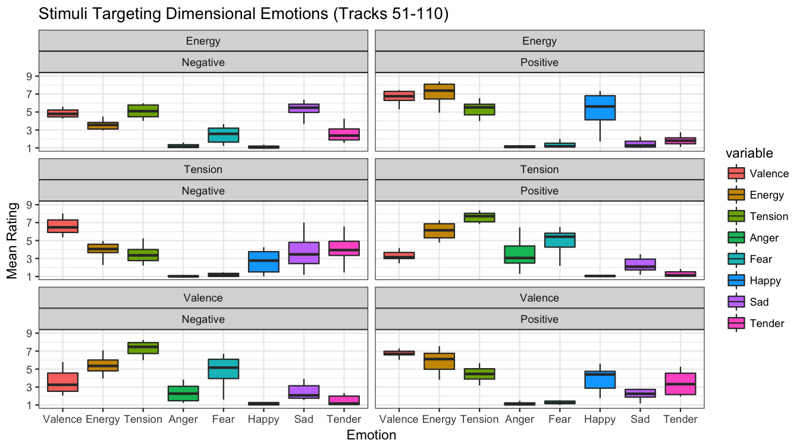

# Music and emotion dataset (Film Soundtracks)

## Background

One drawback in music and emotion research has been the choice, quality, and amount of musical examples used as stimuli. Too often the previous studies have utilized well-known excerpts of Western classical music, which have been chosen arbitrarily by the researchers. Moreover, the stimuli have mostly been highly typical exemplars of the chosen emotions even if the underlying emotion model does not imply that emotions are structured around specific categories.

## Selection of film soundtracks as stimuli

This dataset we refer to as "Soundtracks" are designed to overcome at least some of the above-mentioned problems since they contain not that well known examples (although some could be identified by film aficionados). The selection of the excerpts has been done in terms of dimensional and discrete emotion model (see the paper for details) and evaluated by a pilot study and a larger scale rating study. The soundtracks are short (approx. 15 second) excerpts from film soundtracks. The full details of the stimulus selection and evaluation are available in a paper:

* Eerola, T. & Vuoskoski, J. K. (2011). A comparison of the discrete and dimensional models of emotion in music. _Psychology of Music, 39(1)_, 18-49.
[https://doi.org/10.1177/0305735610362821](https://doi.org/10.1177/0305735610362821)

## Release of stimulus sets

Originally these stimuli were released at [https://www.jyu.fi/hum/laitokset/musiikki/en/research/coe/materials/emotion/soundtracks/](https://www.jyu.fi/hum/laitokset/musiikki/en/research/coe/materials/emotion/soundtracks/), which is hosted by the University of Jyväskylä, Finland. Due to multiple changes in the university web pages and the fact that both authors have moved on from the institute, the page has become unresponsive and difficult to maintain. For this reason, we are now depositing the files to [Open Science Framework](https://osf.io).

The full datasets (audio files, documentation, and behavioural ratings) for Set 1 (360 files) and Set 2 (110 files) are provided here in order to share the stimulus materials for academic research. In addition, we release a longer version of some tracks we also have used in the past (1-min set). The audio files have been compressed to MP3 files using moderate quality compression in a zipped archive that contains files named as `001.mp3` to `360.mp3` corresponding to the index given in the accompanying rating data and tracknames. 

### Corrections and updates

The first release of the data was done in 2011. Since the release, colleagues have commented that some of the track titles are incorrect. These errors concern either the name of the soundtrack or point out that there are two copies of the same stimuli within the Set 2. There is one mislabelled track in the support information; track `009` is from Untouchables and track `017` is from the "The Fifth Element", which have now been corrected to the track listings (see below). 

Two of the tracks have been used twice in the dataset (Set 2). This was intentional since two excerpts fitted two sets of criteria when selecting the excerpts: track `010` is the same as track `095`. Tracks `084` and `088` are from same track but from different segments of the track. Thanks for Masato Miyoshi for informing us about the errors.

#### Set 1 (360 examples)

This Set 1 was developed for piloting purposes and has fewer ratings per track. The initial results of the rating of these tracks were used to develop Set 2, which is probably more reliable and commonly utilised source of musical materials (see paper for details).

* *Audio*: [Set1.zip](Set1.zip)
* *Track names*: [Tracklisting for Set 1](set1_tracklist.md)
* *Ratings*: [mean_ratings_set1.csv](mean_ratings_set1.csv). This is a CSV file with the header that states the stimulus `number`, and mean ratings for `valence`,`energy`,`tension`,`anger`,`fear`,`happy`,`sad`,`tender`, and finally, the intended `TARGET` emotion. The ratings have been given on a scale from 1 (minimal) to 9 (maximal emotion).

#### Set 2 (110 examples)

* *Audio*: [Set2.zip](Set2.zip)
* *Track names*: [Tracklisting for Set 2](set2_tracklist.md)
* *Ratings*: [mean_ratings_set2.csv](mean_ratings_set2.csv). This is a CSV file with the header that states the stimulus `number`, and mean ratings for `Valence`,`Energy`,`Tension`,`Anger`,`Fear`,`Happy`,`Sad`,`Tender`, `Beauty`, `Liking`, and finally, the intended `TARGET` emotion, and `soundtrack` referring to original album, and `link` indicating the track number in Set 1.

#### Quick look at the Set 2 data

As a proof of concept, the following two plots can be replicated with `visualise_ratings.R`, which is a R script using `ggplot2`. It should summarise the ratings across the models and target level of emotions ("High" or "Moderate" for discrete emotions or "Negateive" or "Positive" fo Dimensional emotions) using the mean ratings.

[discrete_boxplot.png](discrete_boxplot.png)

### Bonus item: 1-minute excerpts from film soundtracks

There are 1-minute versions of a small subset of Set 2 examples. These were used in Vuoskoski, Thompson, McIlwain, and Eerola (2012) to induce emotions. These 16 film music excerpts represented for basic emotions (4 scary, 4 happy, 4 sad, and 4 tender), and the length of them ranges from 45 to 77 seconds in duration (mean 57.13 s, SD 9.74). These excerpts were selected from a set of 110 using previously obtained emotion ratings (Eerola & Vuoskoski, 2011). Longer versions of the original 15-second excerpts were taken, and these longer excerpts were then tested in a pilot experiment. 12 participants (mean age 24.67 years, SD 2.27; 58.3% females) rated the emotions expressed by the excerpts using discrete emotion scales (sadness, happiness, anger, fear, and tenderness). Repeated-measures ANOVAs and multiple comparisons of means (Tukey) confirmed that the excerpts conveyed the intended emotions (all post-hoc comparisons were significant at .01 level). 

* *Audio*: [1-min.zip](1-min.zip)

## Past uses of the stimuli

Set 2 (110 examples) has been used at least in the following studies.

* Carlson, E., Saarikallio, S., Toiviainen, P., Bogert, B., Kliuchko, M., & Brattico, E. (2015). Maladaptive and adaptive emotion regulation through music: a behavioral and neuroimaging study of males and females. _Frontiers in Human Neuroscience, 9_, 466.

* Daly, I., Malik, A., Hwang, F., Roesch, E., Weaver, J., Kirke, A., Williams, D., Miranda, E., & Nasuto, S. J. (2014). Neural correlates of emotional responses to music: an EEG study. Neuroscience letters, 573, 52--57.
* Gold, B. P., Frank, M. J., Bogert, B., & Brattico, E. (2013). Pleasurable music affects reinforcement learning according to the listener. _Frontiers in Psychology, 4_, 541.

* Punkanen, M., Eerola, T., & Erkkilä, J. (2011). Biased emotional recognition in depression: Perception of emotions in music by depressed patients. _Journal of Affective Disorders, 130_, 118-126.

* Taruffi, L., Allen, R., Downing, J., & Heaton, P. (2017). Individual differences in music-perceived emotions: the influence of externally oriented thinking. _Music Perception: An Interdisciplinary Journal, 34(3)_, 253--266. [http://mp.ucpress.edu/content/34/3/253](http://mp.ucpress.edu/content/34/3/253)

* Vuoskoski, J. K. & Eerola, T. (2011). The role of mood and personality in the perception of emotions represented by music. _Cortex, 47(9)_, 1099-1106.

* Vuoskoski, J. K., Thompson, B., McIlwain, D., & Eerola, T. (2012). Who enjoys listening to sad music and why? _Music Perception, 29(3)_, 311-317. 

